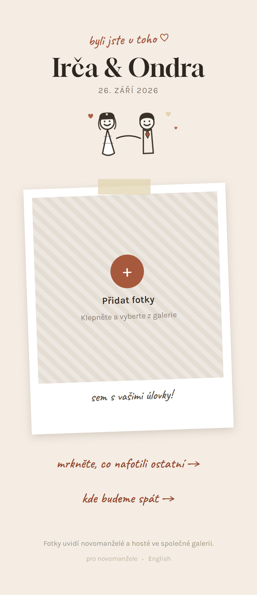
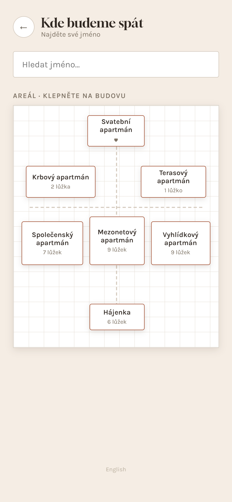
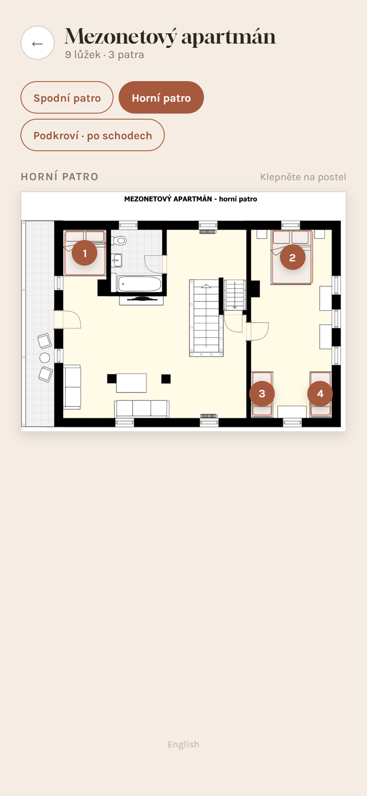

# Screenshots of the original app

Captured on 5 October 2026 from the `event-final` version, against the live data, just before the
backend was taken down. Every screen exists in two sizes with the same file name:

- [`mobile/`](mobile) — 430 × 932 phone viewport at 2× (how guests saw it)
- [`desktop/`](desktop) — 1440 × 900 at 1× (the same 430 px column, centred)

Long pages (gallery, admin) are captured full-height. Czech unless the name ends in `-en`.

| File | Screen |
|---|---|
| `01-upload.png` | Home / upload, uploads open |
| `01-upload-paused.png` | Home with uploads paused by the admin switch |
| `01-upload-en.png` | Home in English |
| `02-gallery.png` | Shared gallery, all photos |
| `02-gallery-lightbox.png` | A photo opened in the lightbox |
| `03-accommodation.png` | *Where we sleep* — site overview |
| `03-accommodation-search.png` | Searching for a guest name |
| `03-accommodation-en.png` | Site overview in English |
| `04-apartment-svatebni.png` | Wedding apartment, bed selected |
| `04-apartment-krbovy.png` | Krbový apartment floor plan |
| `04-apartment-krbovy-bed.png` | Krbový with a bed selected and its guests listed |
| `04-apartment-terasovy.png` | Terasový apartment |
| `04-apartment-spolecensky.png` | Společenský apartment (multi-floor) |
| `04-apartment-mezonet.png` | Mezonetový apartment (multi-floor) |
| `04-apartment-vyhlidkovy.png` | Vyhlídkový apartment (multi-floor) |
| `04-apartment-hajenka.png` | Hájenka (sketch, no floor plan) |
| `05-admin-login.png` | Admin sign-in |
| `05-admin.png` | Admin: pause switch, ZIP download, photo management |
| `05-admin-edit.png` | Admin: editing a photo's name and caption |

  
  
  

